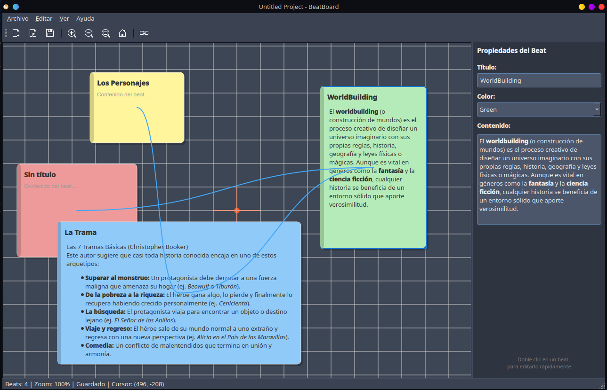

# BeatBoard

[📖 Leer en Español](./README_ES.md)

<!-- Badges Section -->




## Description

BeatBoard is a virtual beat board desktop application for writers, inspired by Final Draft's Beat Board. It provides an infinite canvas where screenwriters, novelists, and short story writers can create, organize, and connect "beats" - the fundamental building blocks of a story.

Whether you're outlining a screenplay, novel, short story, or TV series, BeatBoard helps you visualize your story's structure with colorful cards and flow lines.

## Table of Contents

- [Description](#description)
- [Features](#features)
- [Installation](#installation)
- [Usage](#usage)
- [User Manual](./doc/manual_md/MANUAL_en.md)
- [Keyboard Shortcuts](#keyboard-shortcuts)
- [Project Structure](#project-structure)
- [Contributing](#contributing)
- [License](#license)
- [Acknowledgments](#acknowledgments)

## Features

### Core Features
- **Infinite Canvas** - Pan and zoom across an unlimited workspace
- **Beat Cards** - Create colorful cards with title and content
- **Connections** - Link beats with curved bezier flow lines
- **Drag & Drop** - Freely arrange beats anywhere on the canvas

### Productivity
- **Undo/Redo** - Full history support for all operations
- **Copy/Paste** - Duplicate beats with Ctrl+C / Ctrl+V
- **Z-Order** - Bring to front, send to back, move up/down
- **Multi-select** - Select and move multiple beats at once

### Customization
- **9 Themes** - Light and dark themes (Nord, Dracula, One Dark, etc.)
- **10 Beat Colors** - 7 predefined colors + 3 customizable colors
- **Custom Colors** - Double-click to customize personal colors (8, 9, 0 keys)
- **Custom Background** - Choose from preset or custom canvas colors
- **Optional Grid** - Show/hide alignment grid with customizable size and color

### Internationalization
- **Multi-language Support** - Available in English, Spanish, French, and German
- **System Language Detection** - Automatically detects your system language
- **Persistent Language Preference** - Remembers your language choice

### Export & Save
- **Project Files** - Save and load .bbp project files
- **Auto-save** - Automatic saving every 5 minutes
- **Export PDF** - Generate PDF documents of your beat board
- **Export Text** - Export beats as plain text

### Additional
- **Properties Panel** - Edit selected beat properties
- **Status Bar** - Real-time cursor coordinates display
- **Center Point** - Visual guide at origin (0,0)

## Installation

### Prerequisites
- Python 3.10 or higher
- PySide6

### From Source

```bash
# Clone the repository
git clone https://github.com/carlymx/BeatBoard.git
cd BeatBoard

# Create virtual environment (recommended)
python -m venv .venv
source .venv/bin/activate  # Linux/macOS
# .venv\Scripts\activate  # Windows

# Install dependencies
pip install pyside6

# Run the application
python -m beatboard.app.main
```

### Pre-built Executables

Download from the [Releases](https://github.com/carlymx/BeatBoard/releases) page or build from source (see below):

| Platform | Type | File |
|----------|------|------|
| Linux | AppImage | `BeatBoard-Linux-x86_64-QT6_PySide6-v1.0.7.AppImage` |
| Linux | Portable | `BeatBoard-Linux-x86_64-QT6_PySide6-v1.0.7_portable` |
| Windows | Executable | `BeatBoard.exe` (via GitHub Actions) |

### System Requirements

- **Linux**: Ubuntu 20.04+, Linux Mint 20+, Debian 11+, Fedora 34+ (GLIBC 2.31+)

### Build from Source

To compile the executable and AppImage yourself:

```bash
# 1. Navigate to project directory
cd BeatBoard

# 2. Build with Docker/Podman (recommended for maximum compatibility)
podman build -t beatboard-builder:latest -f build/Dockerfile .

# 3. Extract generated files
podman run --rm -v $(pwd)/build:/output:Z beatboard-builder:latest \
    cp -r /build/AppDir /output/ && cp /build/output/BeatBoard-portable /output/

# 4. Create AppImage (requires FUSE)
cd build
wget -q https://github.com/AppImage/AppImageKit/releases/download/continuous/appimagetool-x86_64.AppImage -O appimagetool
chmod +x appimagetool
./appimagetool -s AppDir BeatBoard-x86_64.AppImage
```

Generated files will be in `build/`:
- `BeatBoard-portable` - Portable executable
- `BeatBoard-x86_64.AppImage` - Self-contained AppImage

See `DESARROLLOActual.md` for detailed build instructions.

### Run AppImage (Linux)

```bash
chmod +x BeatBoard-x86_64.AppImage
./BeatBoard-x86_64.AppImage
```

## Usage

### Getting Started

1. **Create a Beat** - Double-click anywhere on the canvas
2. **Edit a Beat** - Double-click on a beat to open the editor
3. **Move a Beat** - Click and drag to reposition
4. **Connect Beats** - Click "Connect" in toolbar, then click source and target beats

### Managing Beats

- **Delete**: Select beat(s) and press Delete/Supr
- **Copy**: Ctrl+C to copy selected beats
- **Paste**: Ctrl+V to paste copied beats
- **Select All**: Ctrl+A to select all beats

### Working with Connections

1. Click the "Connect" button in the toolbar
2. Click on the source beat
3. Click on the target beat
4. Press Escape to exit connection mode

### User Manual

For a complete usage guide, see the manual in your language:

- [Español](./doc/manual_md/MANUAL_es.md)
- [English](./doc/manual_md/MANUAL_en.md)
- [Français](./doc/manual_md/MANUAL_fr.md)
- [Deutsch](./doc/manual_md/MANUAL_de.md)

## Keyboard Shortcuts

| Shortcut | Action |
|----------|--------|
| Ctrl+Z | Undo |
| Ctrl+Y | Redo |
| Ctrl+A | Select All |
| Ctrl+C | Copy |
| Ctrl+X | Cut |
| Ctrl+V | Paste |
| Delete | Delete selected |
| Ctrl+Home | Bring to Front |
| Ctrl+End | Send to Back |
| Ctrl+PageUp | Move Up |
| Ctrl+PageDown | Move Down |
| Ctrl+0 | Fit to Content |
| Ctrl++ | Zoom In |
| Ctrl+- | Zoom Out |
| Space | Pan mode (hold) |
| Escape | Cancel / Deselect |
| 1-0 | Change selection color |
| C | Toggle connection mode (no selection) |

## Project Structure

```
BeatBoard/
├── beatboard/
│   ├── app/              # Application entry point
│   │   ├── main.py
│   │   └── application.py
│   ├── core/             # Core data models
│   │   ├── beat.py
│   │   ├── connection.py
│   │   ├── project.py
│   │   └── constants.py
│   ├── ui/               # User interface
│   │   ├── main_window.py
│   │   ├── theme_manager.py
│   │   ├── canvas/       # Graphics view components
│   │   ├── dialogs/      # Dialog windows
│   │   └── widgets/      # Custom widgets
│   ├── services/         # Business logic
│   │   ├── autosave_service.py
│   │   └── export_service.py
│   └── tests/            # Unit tests
├── dist/                 # Built executables
├── beatboard.spec        # PyInstaller spec
└── README.md
```

## Running Tests

```bash
# Activate virtual environment
source .venv/bin/activate

# Run all tests
python -m pytest beatboard/tests/ -v

# Run specific test file
python -m pytest beatboard/tests/test_beat.py -v
```

## Contributing

Contributions are welcome! Please follow these steps:

1. Fork the repository
2. Create a feature branch (`git checkout -b feature/amazing-feature`)
3. Commit your changes (`git commit -m 'Add amazing feature'`)
4. Push to the branch (`git push origin feature/amazing-feature`)
5. Open a Pull Request

## License

This project is licensed under the [Creative Commons BY-NC 4.0](https://creativecommons.org/licenses/by-nc/4.0/legalcode) License.

**You are free to:**
- Share — copy and redistribute the material
- Adapt — remix, transform, and build upon the material

**Under the following terms:**
- Attribution — You must give appropriate credit
- NonCommercial — You may not use the material for commercial purposes

## Changelog

### v1.0.27 (2026-03-09)
- **Area selection zoom**: New zoom mode that allows drawing a rectangle to zoom to the selected area
- **Zoom toolbar button**: New "Zoom" icon between zoom-in and fit
- **"Z" keyboard shortcut**: Activates selection zoom mode when nothing is selected
- **Connection mode banner fix**: Fixed issue where the banner was not showing
- **Updated shortcuts**: Added "Z" (zoom) and "Ctrl+W" (close project) to shortcuts dialog
- **Shortcut descriptions corrected**: Now indicate "double-click" to create/edit beats
- **Keyboard panning fix**: Fixed issue where panning with Space key wasn't working correctly

### v1.0.26 (2026-03-09)
- **Connection properties bug fixes**: Fixed issue where multiple connection selections didn't apply changes
- **Extended keyboard shortcuts**: Keys 1-0 now change colors for both beats AND connections
- **Connection color customization**: Added custom colors (8, 9, 0) to connection property widgets
- **New connection color**: Added 7th predefined color "Dark Gray" (#616161)
- **Connection mode shortcut**: Added "C" key to toggle connection mode when nothing is selected
- **Updated shortcut descriptions**: Changed "Change beat color" to "Change selection color" in all languages
- **Real-time property updates**: Connection property panel updates when using keyboard shortcuts
- **Improved color rendering**: Fixed hex color display for custom connection colors

### v1.0.25 (2026-03-08)
- **General properties column**: Properties panel now works for beats, connections, and multiple selection
- **Connection properties**: New fields for line color, width (0.5-10px), and terminator shapes (circle, square, arrow, none)
- **Multiple selection support**: Change common properties for multiple beats or connections simultaneously
- **Mixed state display**: Combos show no selection and checkboxes show partially checked when values differ
- **Terminator rendering**: Visual terminators at line ends based on selected shape
- **Real-time updates**: Color indicators update when using keyboard shortcuts (1-0)

### v1.0.21 (2026-03-08)
- **"Open full editor" button**: New button in properties panel to open full beat editor with rich formatting

### v1.0.20 (2026-03-08)
- **Theme background color**: Each theme now has associated background and grid colors that are applied automatically

### v1.0.19 (2026-03-06)
- **Z-Order system fixed**: Each new beat is created with z = total number of beats + 1
- **Unique consecutive Z positions**: Beats occupy unique positions (1, 2, 3...)
- **Improved Z movement**: Moving beats up/down now swaps positions with adjacent beats
- **Bring to front/send to back**: Correctly reorders the entire beat stack
- **Z debug visual**: Shows "z:X" on each object (DEBUG_SHOW_Z_ORDER constant in constants.py)

### v1.0.17 (2026-03-04)
- **Better selection visibility**: Thicker selection borders (4px beats, 5px connections) for improved visibility
- **Full content visible**: Beats now automatically expand height to show all content without truncation
- **Color indicator in properties**: New widget showing currently selected color in real-time
- **Fixed indicator update**: Color indicator updates correctly when using number keys (1-0)

### v1.0.16 (2026-03-04)
- **New Preferences menu**: Reorganized menu with preferences options before Help
- **Configurable backup options**: Backup on open, max backups, auto-save interval
- **Complete translations**: Beat labels and colors translated to all 4 languages
- **Application icon fix**: Fixed issue with icon in Windows taskbar/title bar

### v1.0.15 (2026-03-04)
- **Complete color system overhaul**: All colors now use hexadecimal format (#FFFFFF)
- **Fixed "More Colors..." button**: Now works correctly with custom colors
- **Added 3 customizable colors**: Personalizable colors 8, 9, 0 (initially white)
- **Extended keyboard shortcuts**: Keys 1-0 now change colors (1-7 predefined, 8-0 customizable)
- **Backward compatibility**: Old beats with color names (yellow, blue, etc.) still work
- **Persistent custom colors**: Saved in preferences.json
- **Color personalization**: Alt+Click on customizable colors to change them

### v1.0.13 (2026-03-03)
- Added visual indicator for Connection Mode (translucent banner at bottom of canvas)
- Fixed cursor not showing as cross in Connection Mode (viewport cursor priority fix)
- Added translations for connection mode banner in all 4 languages

### v1.0.12 (2026-03-03)
- Added checkbox to show/hide beat titles
- Fixed spellcheck lazy loading (dictionaries load only when needed)
- Fixed checkbox state comparison in properties panel

### v1.0.11 (2026-03-03)
- Optimized spellcheck performance with lazy loading of dictionaries
- Improved startup time by not loading dictionaries until spellcheck is enabled
- Added "Show title" checkbox to properties panel for individual beats

### v1.0.10 (2026-02-28)
- Added spell check support for beat content
- Integrated Hunspell dictionaries (en, es, fr, de)
- Added spell check menu in View menu
- Added option for user dictionaries in ~/.config/beatboard/dictionaries/
- Added right-click context menu for spell suggestions
- Added SpellCheckService for dictionary management
- Added SpellCheckHighlighter for visual error marking

### v1.0.7 (2026-02-28)
- Added custom application icon for Windows executable
- Added cross-platform config paths (Windows: %APPDATA%, macOS: Application Support, Linux: .config)
- Added GitHub Actions workflow for Windows build

### v1.0.5 (2026-02-27)
- Added multi-language support (English, Spanish, French, German)
- Added system language detection on first launch
- Added customizable grid color with color picker
- Added custom grid color option in grid settings
- Changed grid size options to: 50, 100, 150, 200, 250
- Fixed toolbar icons embedded in the executable
- Fixed preferences.json creation on first launch
- Added restart notification when changing language

### v1.0.1 (2026-02-27)
- Fixed toolbar icons (now embedded in the app instead of system-dependent)
- Added theme-aware icons (light icons for dark theme, dark icons for light theme)
- Compiled with Ubuntu 22.04 for maximum compatibility with Linux distributions

### v1.0.0 (2026-02-27)
- Initial release
- Infinite canvas with pan and zoom
- Beat cards with title and content
- Connections between beats with bezier curves
- 9 themes (light and dark)
- 8 beat colors
- Undo/Redo system
- Copy/Paste beats
- Z-order management
- Keyboard shortcuts
- Auto-save
- Export PDF/Text
- Preferences persistence
- Properties panel
- Grid and background customization
- Bug fixes: connections loading, z-order saving

## Acknowledgments

- Inspired by [Final Draft Beat Board](https://www.finaldraft.com/)
- Built with [PySide6](https://www.qt.io/qt-for-python)
- Icon design by CarlyMx

---

**Author:** CarlyMx  
**Email:** carlymx@gmail.com  
**GitHub:** https://github.com/carlymx/BeatBoard
