# Manuel Utilisateur de BeatBoard

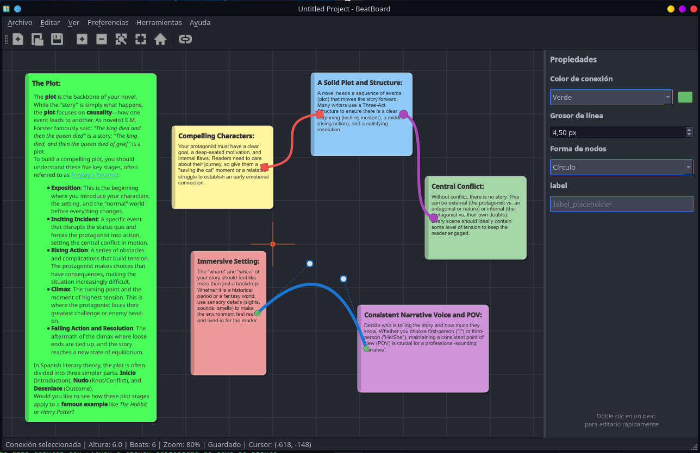

## Table des Matières

1. [Introduction](#introduction)
2. [Premiers Pas](#premiers-pas)
3. [Interface Utilisateur](#interface-utilisateur)
4. [Gestion des Beats](#gestion-des-beats)
5. [Connexions entre Beats](#connexions-entre-beats)
6. [Outils du Canevas](#outils-du-canevas)
7. [Personnalisation](#personnalisation)
8. [Exportation et Enregistrement](#exportation-et-enregistrement)
9. [Raccourcis Clavier](#raccourcis-clavier)
10. [Dépannage](#dépannage)

---

## Introduction

BeatBoard est une application de bureau de tableau blanc virtuel pour écrivains, inspirée du Beat Board de Final Draft. C'est un outil particulièrement conçu pour les scénaristes, écrivains de nouvelles et romans qui ont besoin de visualiser la structure de leurs histoires.

Avec BeatBoard, vous pouvez :
- Créer un canevas infini pour organiser vos idées
- Créer des cartes de beat avec titre et contenu
- Connecter les beats avec des lignes courbes
- Organiser et réorganiser visuellement vos éléments
- Personnaliser l'apparence avec des thèmes et des couleurs
- Exporter votre travail en PDF ou texte

---

## Premiers Pas

### Installation

Pour exécuter BeatBoard :

1. **Depuis le code source** :
   ```bash
   cd BeatBoard
   python -m venv .venv
   source .venv/bin/activate  # Linux/macOS
   # .venv\Scripts\activate  # Windows
   pip install pyside6
   python -m beatboard.app.main
   ```

2. **Exécutable précompilé** :
   Téléchargez le fichier exécutable depuis la page des versions et lancez-le directement.

### Créer votre Premier Projet

Au démarrage de BeatBoard, un projet vierge est automatiquement créé. Vous pouvez commencer immédiatement à créer des beats sur le canevas.

Pour enregistrer votre projet :
1. Allez dans **Fichier > Enregistrer** (ou appuyez sur **Ctrl+S**)
2. Choisissez l'emplacement et le nom de votre fichier
3. Les projets BeatBoard ont l'extension `.bbp`

---

## Interface Utilisateur

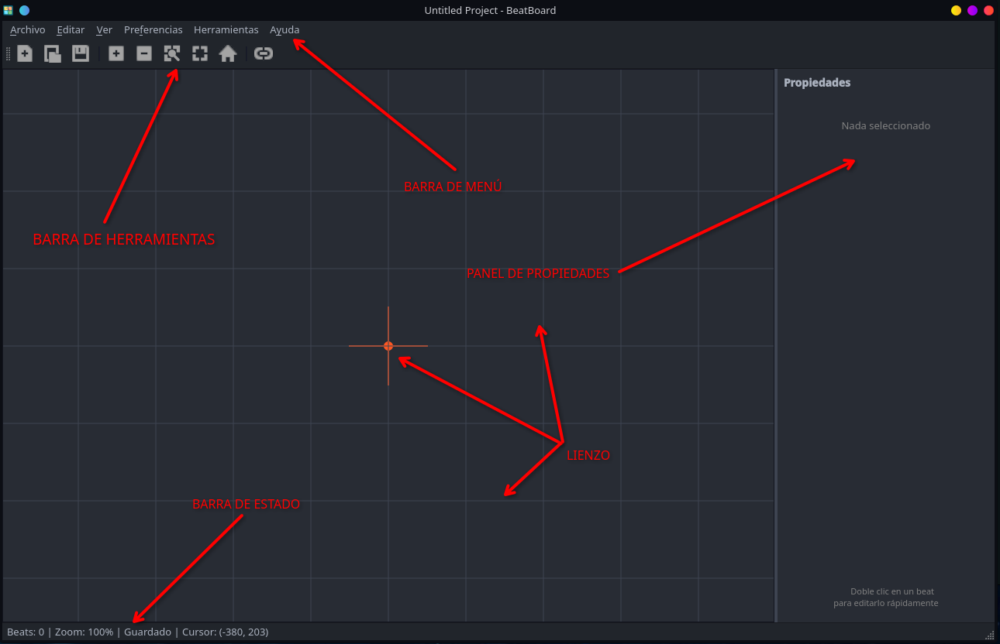

L'interface de BeatBoard est divisée en zones suivantes :

### Barre d'Outils

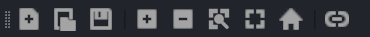

La barre d'outils offre un accès rapide aux fonctions les plus utilisées :

| Bouton | Fonction | Raccourci |
|--------|----------|-----------|
| Nouveau | Créer un nouveau projet | Ctrl+N |
| Ouvrir | Ouvrir un projet existant | Ctrl+O |
| Enregistrer | Enregistrer le projet | Ctrl+S |
| + (Zoom avant) | Augmenter le zoom | Ctrl++ |
| - (Zoom arrière) | Diminuer le zoom | Ctrl+- |
| Zoom | Zoom de sélection de zone | Z |
| Ajuster | Ajuster la vue au contenu | Ctrl+0 |
| Centrer | Centrer la vue sur l'origine | - |
| Connecter | Activer le mode connexion | C |

### Panneau des Propriétés

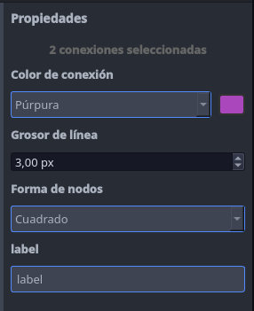

Le panneau des propriétés (situé à droite) permet de modifier l'élément sélectionné :

- **Aucun beat sélectionné** : Affiche un message indiquant "Rien de sélectionné"
- **Un beat sélectionné** : Permet de modifier le titre, le contenu, la couleur et la visibilité du titre
- **Plusieurs beats sélectionnés** : Permet de modifier les propriétés communes à tous
- **Connexion sélectionnée** : Permet de modifier la couleur, l'épaisseur, la forme des nœuds et l'étiquette

### Barre d'État

La barre inférieure affiche des informations utiles :
- Nombre de beats dans le projet
- Niveau de zoom actuel
- État du projet (Modifié/Enregistré)
- Position du curseur sur le canevas

---

## Gestion des Beats

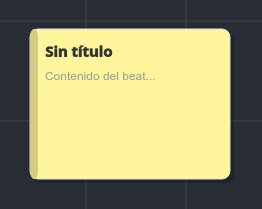

### Créer un Beat

**Méthode 1 - Double clic** :
1. Double-cliquez sur une zone vide du canevas
2. Un nouveau beat sera créé à cette position

### Modifier un Beat

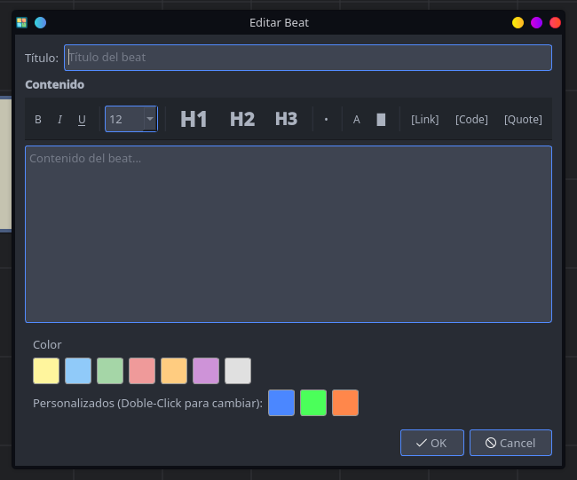

**Modification rapide** :
1. Double-cliquez sur le beat que vous souhaitez modifier
2. La boîte de dialogue de modification du beat s'ouvrira

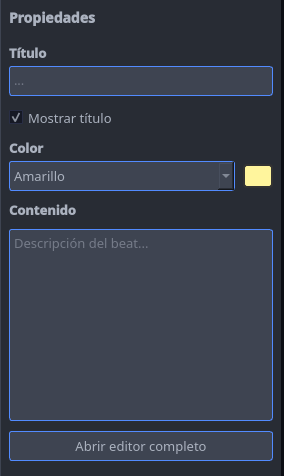

**Modification depuis le panneau des propriétés** :
1. Sélectionnez le beat
2. Modifiez le titre ou le contenu directement dans le panneau des propriétés
3. Les modifications sont appliquées automatiquement

**Éditeur complet** :
1. Sélectionnez le beat
2. Dans le panneau des propriétés, cliquez sur "Ouvrir l'éditeur complet"
3. La boîte de dialogue avec les options de formatage avancées s'ouvrira

### L'Éditeur de Beat

L'éditeur de beat offre les outils de formatage suivants :

#### Barre de Formatage
- **B** (Gras) : Applique le format gras au texte sélectionné
- *I* (Italique) : Applique le format italique
- **U** (Souligné) : Applique le format souligné
- **Taille de police** : Sélecteur de taille de police (8-32pt)
- **H1, H2, H3** : Insérer des titres de différents niveaux
- **•** (Puces) : Insérer une liste à puces
- **A** (Couleur du texte) : Changer la couleur du texte sélectionné
- **█** (Surlignage) : Appliquer une couleur de fond au texte
- **[Link]** : Insérer un hyperlien
- **[Code]** : Insérer du texte au format code
- **[Quote]** : Insérer une citation

#### Champs de l'Éditeur
- **Titre** : Nom du beat (optionnel)
- **Contenu** : Description détaillée du beat (supporte le formatage riche)
- **Couleur** : Sélecteur de couleur du beat

### Déplacer un Beat

1. Cliquez sur le beat
2. Faites glisser le beat vers la nouvelle position
3. Relâchez le bouton de la souris

### Sélection Multiple

**Sélectionner plusieurs beats** :
- Maintenez la touche **Ctrl** enfoncée tout en cliquant sur chaque beat
- Ou faites glisser un rectangle de sélection autour des beats souhaités

**Déplacer plusieurs beats** :
1. Sélectionnez plusieurs beats
2. Faites glisser l'un d'entre eux
3. Tous les beats sélectionnés se déplaceront ensemble

### Copier et Coller

- **Copier** : Sélectionnez le beat et appuyez sur **Ctrl+C**
- **Couper** : Sélectionnez le beat et appuyez sur **Ctrl+X**
- **Coller** : Appuyez sur **Ctrl+V** pour créer une copie au centre du canevas

### Supprimer un Beat

1. Sélectionnez le beat (ou les beats)
2. Appuyez sur **Supprimer** ou avec le **clic droit > Supprimer**

### Ordre Z (Profondeur)

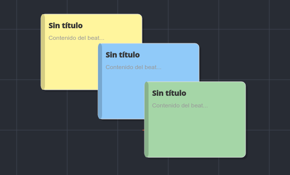

BeatBoard vous permet de contrôler quels beats apparaissent devant les autres :

| Action | Raccourci | Description |
|--------|-----------|-------------|
| Mettre au premier plan | Ctrl+Home | Déplace le beat vers le calque supérieur |
| Envoyer à l'arrière-plan | Ctrl+End | Déplace le beat vers le calque inférieur |
| Monter d'un cran | Ctrl+PageUp | Échange la position avec le beat immédiatement au-dessus |
| Descendre d'un cran | Ctrl+PageDown | Échange la position avec le beat immédiatement en dessous |

### Couleurs des Beats

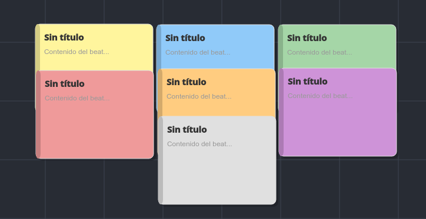

BeatBoard offre 10 couleurs prédéfinies et 3 personnalisables :

| Touche | Couleur |
|--------|---------|
| 1 | Jaune |
| 2 | Bleu |
| 3 | Vert |
| 4 | Rouge |
| 5 | Orange |
| 6 | Violet |
| 7 | Gris |
| 8 | Personnalisable 1 |
| 9 | Personnalisable 2 |
| 0 | Personnalisable 3 |

**Changer la couleur au clavier** :
1. Sélectionnez un ou plusieurs beats
2. Appuyez sur une touche de 1 à 0

**Personnaliser les couleurs** :
1. Sélectionnez un beat et ouvrez l'**Éditeur complet**
2. Double-cliquez sur l'une des trois couleurs personnalisables et modifiez-la

---

## Connexions entre Beats

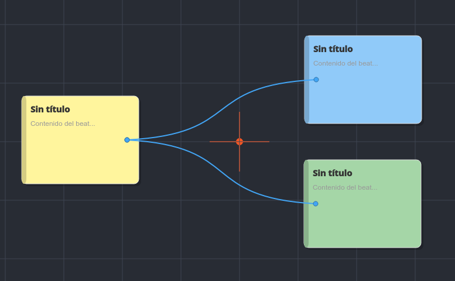

Les connexions sont des lignes courbes qui relient deux beats, montrant le flux de l'histoire.

### Créer une Connexion

**Méthode 1 - Barre d'outils** :
1. Cliquez sur le bouton "Connecter" dans la barre d'outils (ou appuyez sur **C**)
2. Le curseur deviendra une crois
3. Cliquez sur le beat source
4. Cliquez sur le beat cible
5. La connexion sera créée automatiquement
6. Appuyez sur **Échap** pour quitter le mode connexion

**Note** : Lorsque le mode connexion est actif, une bannière apparaît au bas du canevas indiquant "Mode 'Connexion' Activé".

### Modifier une Connexion

**Sélectionner une connexion** :
- Cliquez directement sur la ligne de connexion
- La connexion sera mise en évidence avec une bordure bleue

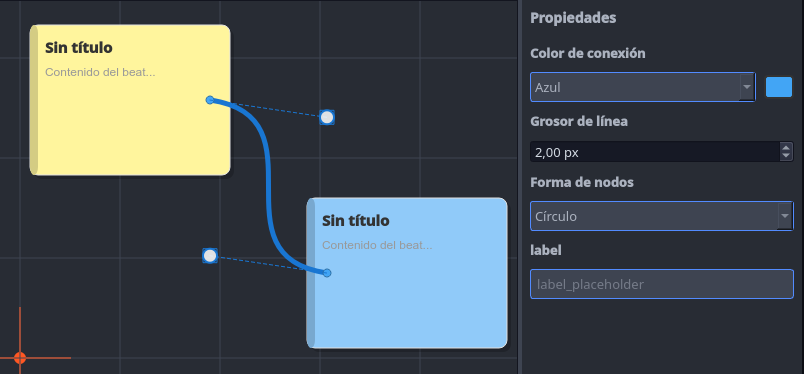

**Propriétés de connexion** (dans le panneau des propriétés) :
- **Couleur** : Couleur de la ligne (rouge, bleu, vert, jaune, orange, violet, gris foncé)
- **Épaisseur** : Épaisseur de la ligne (0,5 - 10 px)
- **Forme des nœuds** : Forme du terminateur aux extrémités :
  - Cercle
  - Carré
  - Flèche
  - Aucun
- **Étiquette** : Texte qui apparaît au centre de la connexion

### Nœuds Modifiables

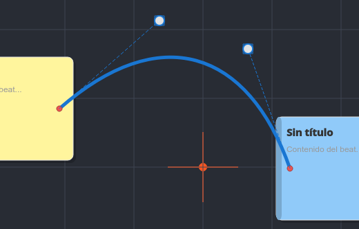

Les connexions ont des points de contrôle qui permettent de modifier leur courbure :

1. Sélectionnez la connexion
2. Deux poignées (points) apparaîtront sur la ligne
3. Faites glisser les poignées pour ajuster la courbe
4. Double-cliquez sur une poignée pour réinitialiser la courbure par défaut

### Supprimer une Connexion

1. Sélectionnez la connexion
2. Appuyez sur **Supprimer**

---

## Outils du Canevas

### Zoom

**Zoom avant** :
- Allez dans **Affichage > Zoom avant**
- Appuyez sur **Ctrl++**
- Ou utilisez le bouton "+" dans la barre d'outils

**Zoom arrière** :
- Allez dans **Affichage > Zoom arrière**
- Appuyez sur **Ctrl+-**
- Ou utilisez le bouton "-" dans la barre d'outils

**Ajuster au contenu** :
- Allez dans **Affichage > Ajuster au contenu**
- Appuyez sur **Ctrl+0**
- Ou utilisez le bouton ajuster dans la barre d'outils

**Zoom de sélection de zone** :
1. Appuyez sur **Z** ou cliquez sur le bouton de zoom dans la barre d'outils
2. Faites glisser un rectangle autour de la zone que vous souhaitez voir
3. La vue se centrera et s'ajustera à la zone sélectionnée
4. Appuyez sur **Échap** pour annuler

### Déplacement (Panning)

**Au clavier** :
- Maintenez la touche **Espace** enfoncée
- Faites glisser la souris pour déplacer le canevas

**À la souris** :
- Maintenez le bouton central de la souris enfoncé
- Faites glisser pour déplacer le canevas

### Grille

La grille aide à aligner visuellement les beats.

**Afficher/Masquer** :
- Allez dans **Affichage > Afficher la grille**
- Ou utilisez le raccourci configuré

**Personnaliser la grille** :
1. Allez dans **Affichage > Options de grille**
2. **Taille de cellule** : Choisissez entre 50, 100, 150, 200 ou 250 px
3. **Couleur de la grille** : 
   - Auto : S'adapte au thème
   - Couleurs prédéfinies : Jaune, Bleu, Vert, Rouge, Orange, Violet, Gris
   - Personnalisé : Choisissez votre propre couleur

### Point Central

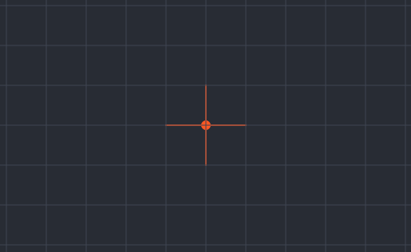

Le point central (origine 0,0) est affiché comme une petite croix au centre du canevas. Cliquez sur le bouton "Centrer" de la barre d'outils pour déplacer la vue vers l'origine.

---

## Personnalisation

### Thèmes

BeatBoard propose 9 thèmes différents :

**Thèmes clairs** :
- Clair (par défaut)
- Solarized Light
- GitHub Light
- PaperColor

**Thèmes sombres** :
- Sombre (par défaut)
- Dracula
- Nord
- One Dark
- Material Dark

**Appliquer un thème** :
1. Allez dans **Préférences > Thème**
2. Sélectionnez le thème souhaité
3. Vous pouvez aussi choisir "Système" pour utiliser le thème de votre système d'exploitation

### Couleur de Fond du Canevas

Vous pouvez personnaliser la couleur de fond du canevas :

1. Allez dans **Préférences > Couleur de fond**
2. Choisissez parmi :
   - Blanc
   - Gris clair
   - Gris
   - Gris foncé
   - Crème
   - Sombre
   - Noir
   - Personnalisé (choisissez votre propre couleur)

**Réinitialiser les couleurs du thème** :
- Sélectionnez "Réinitialiser les couleurs du thème" pour revenir aux couleurs par défaut du thème actuel

### Mémoriser les Valeurs par Défaut

Activez l'option **"Mémoriser la taille et la couleur du dernier beat"** dans Préférences afin que les nouveaux beats héritent de la taille et de la couleur du dernier beat créé.

### Langue

BeatBoard est disponible en 4 langues :
- Anglais (English)
- Espagnol (Español)
- Français
- Allemand (Deutsch)

Pour changer la langue :
1. Allez dans **Préférences > Langue**
2. Sélectionnez la langue souhaitée
3. Redémarrez l'application pour appliquer le changement

### Correction Orthographique

BeatBoard inclut un correcteur orthographique intégré :

**Activer** :
1. Allez dans **Préférences > Correction orthographique > Activer la correction orthographique**

**Langue du dictionnaire** :
1. Allez dans **Préférences > Correction orthographique > Langue du dictionnaire**
2. Sélectionnez la langue : Anglais, Espagnol, Français ou Allemand

**Utiliser le correcteur** :
- Les mots incorrects seront soulignés en rouge
- Faites un clic droit sur un mot pour voir les suggestions

---

## Exportation et Enregistrement

### Format de Fichier

Les projets BeatBoard sont enregistrés au format `.bbp` (JSON). Ce format inclut :
- Tous les beats (titre, contenu, position, taille, couleur)
- Toutes les connexions
- Paramètres du canevas

### Enregistrer le Projet

- **Enregistrer** : **Ctrl+S** (enregistre dans le fichier actuel)
- **Enregistrer sous** : **Ctrl+Maj+S** (choisit l'emplacement et le nom)

### Exporter en PDF

- En développement

### Exporter en Texte

1. Allez dans **Fichier > Exporter en texte**
2. Sélectionnez l'emplacement et le nom du fichier
3. Un fichier texte avec tous les beats sera généré

### Fichiers Récents

BeatBoard conserve une liste des 10 derniers fichiers ouverts :

1. Allez dans **Fichier > Fichiers récents**
2. Sélectionnez le fichier souhaité

Si un fichier de la liste n'existe plus, il vous sera demandé si vous souhaitez le supprimer de la liste.

### Enregistrement Automatique

BeatBoard peut enregistrer automatiquement votre projet :

1. Allez dans **Préférences > Options de sauvegarde**
2. Configurez :
   - **Sauvegarde à l'ouverture** : Crée une copie à l'ouverture du projet
   - **Enregistrement automatique** : Active/désactive l'enregistrement automatique
   - **Intervalle** : Fréquence d'enregistrement (1, 2, 5, 10, 15 ou 30 minutes)
   - **Nombre maximum de sauvegardes** : Nombre de sauvegardes à conserver

---

## Raccourcis Clavier

### Fichier

| Raccourci | Fonction |
|-----------|----------|
| Ctrl+N | Nouveau projet |
| Ctrl+O | Ouvrir un projet |
| Ctrl+S | Enregistrer le projet |
| Ctrl+Maj+S | Enregistrer sous |
| Ctrl+W | Fermer le projet |
| Ctrl+Q | Quitter |

### Édition

| Raccourci | Fonction |
|-----------|----------|
| Ctrl+Z | Annuler |
| Ctrl+Y | Rétablir |
| Ctrl+A | Tout sélectionner |
| Ctrl+C | Copier |
| Ctrl+X | Couper |
| Ctrl+V | Coller |
| Supprimer | Supprimer la sélection |
| Ctrl+Accueil | Mettre au premier plan |
| Ctrl+Fin | Envoyer à l'arrière-plan |
| Ctrl+PageUp | Monter d'un cran |
| Ctrl+PageDown | Descendre d'un cran |

### Affichage

| Raccourci | Fonction |
|-----------|----------|
| Ctrl++ | Zoom avant |
| Ctrl+- | Zoom arrière |
| Ctrl+0 | Ajuster au contenu |
| Espace | Mode déplacement (maintenir) |

### Autres Raccourcis

| Raccourci | Fonction |
|-----------|----------|
| 1-0 | Changer la couleur de la sélection |
| C | Activer/désactiver le mode connexion (sans sélection) |
| Z | Zoom de sélection (sans sélection) |
| Échap | Annuler / Tout désélectionner |
| Double-clic (canevas) | Créer un nouveau beat |
| Double-clic (beat) | Modifier le beat |

---

## Dépannage

### Le programme ne démarre pas

1. Vérifiez que Python 3.10+ est installé
2. Assurez-vous d'avoir installé PySide6 : `pip install pyside6`
3. Vérifiez qu'il n'y a pas d'erreurs dans le terminal

### Les beats ne s'enregistrent pas

1. Vérifiez que vous avez les droits d'écriture dans le dossier
2. Assurez-vous d'enregistrer le projet avant de fermer (Ctrl+S)
3. Vérifiez l'état du projet dans la barre d'état (doit dire "Enregistré")

### La grille ne s'affiche pas

1. Vérifiez que la grille est activée : **Affichage > Afficher la grille**
2. Essayez de changer la couleur de la grille dans **Affichage > Options de grille**

### Le correcteur orthographique ne fonctionne pas

1. Vérifiez qu'il est activé dans **Préférences > Correction orthographique**
2. Assurez-vous d'avoir sélectionné la bonne langue de dictionnaire

### Les couleurs personnalisées ne s'enregistrent pas

1. Les couleurs personnalisées sont enregistrées dans les préférences, pas dans le projet
2. Elles sont automatiquement appliquées aux beats futurs selon la configuration

---

## Informations Supplémentaires

### Raccourcis Souris

- **Double-clic sur le canevas** : Créer un nouveau beat
- **Double-clic sur un beat** : Modifier le beat
- **Clic simple** : Sélectionner un élément
- **Ctrl + Clic** : Ajouter à la sélection
- **Glisser (sélection)** : Créer un rectangle de sélection
- **Glisser (beat)** : Déplacer le beat
- **Roulette de souris** : Zoom (avec Ctrl enfoncé)
- **Bouton central de la souris** : Déplacement

### Glossaire

- **Beat** : Carte individuelle sur le canevas représentant une scène ou un moment de l'histoire
- **Connexion** : Ligne courbe qui relie deux beats
- **Canevas** : Zone de travail où les beats sont placés
- **Ordre Z** : Profondeur ou calque d'un élément (ce qui apparaît au-dessus de quoi)
- **Thème** : Ensemble de couleurs et de styles qui définissent l'apparence de l'application
- **Panneau des propriétés** : Panneau latéral où les propriétés de l'élément sélectionné sont modifiées

---

## Crédits

BeatBoard a été créé par CarlyMx et est inspiré de Final Draft Beat Board.

Pour plus d'informations, mises à jour et support, consultez le dépôt GitHub.

---

*Manuel créé pour BeatBoard version 1.0.27*
